# Async Logger

A high-performance, asynchronous logging library for C++23 and C. Designed for modern systems that require non-blocking logging across multiple concurrent data streams.

[](https://github.com/kvzidev/async-logger/actions/workflows/ci.yml)
[](https://opensource.org/licenses/MIT)
[](https://en.cppreference.com/w/cpp/23)

## Features

- **Non-Blocking**: Submits log messages to a synchronized queue and processes them in a dedicated worker thread.
- **C++23 Modern API**: Ergonomic interface using specialty methods (`Info`, `Warn`, `Error`) and move-only semantics.
- **C Compatibility**: Provides a clean C API using opaque pointers and static inline helpers.
- **Compile-Time Stripping**: Zero-overhead logging with levels that can be stripped at compile-time.
- **Log Rotation**: Built-in size-based rotation and generation management.
- **Zero-Dependency**: Depends only on the standard library and C++23 compliant compilers.

## Quick Start

The logger can be initialized with different output destinations, these are `Logger_Out_None`, `Logger_Out_Console` and `Logger_Out_File`.

### C++ Usage
```cpp
#include <logger.h>

int main() {
    Logger logger = Logger::New("app.log", Logger_Out_Console | Logger_Out_File);
    
    if (!logger) {
        return 1;
    }

    logger.Info("Application started.");
    logger.Debug("Modern C++23 is active.");
    logger.Warn("Configuration file not found, using defaults.");    
}
```

### C Usage
```c
#include <logger.h>
#include <stdio.h>

int main() {
    Logger* logger = Logger_New("app.log", Logger_Out_Console);
    if (logger == NULL) {
        fprintf(stderr, "Failed to initialize logger\n");
        return 1;
    }
    
    Logger_Info(logger, "C Application started.");
    Logger_Error(logger, "Connection lost, retrying...");
    
    Logger_Free(logger);
    return 0;
}
```

## Advanced Features

### Log Rotation
Prevent uncontrolled disk usage by configuring file rotation.

```cpp
Logger logger = Logger::New("service.log", Logger_Out_File);
logger.SetMaxFileSize(10 * 1024 * 1024); // 10MB
logger.SetMaxFiles(5);                   // Keep 5 rotated generations
```

### Compile-Time Stripping
To achieve zero overhead for lower log levels in production, define `ASYNC_LOGGER_MIN_LEVEL` before including `logger.h`.

```cpp
// Only Info and above will be compiled into the binary
#define ASYNC_LOGGER_MIN_LEVEL ASYNC_LOGGER_LEVEL_INFO
#include <logger.h>
```

Available levels: `TRACE`, `DEBUG`, `INFO`, `WARN`, `ERROR`, `FATAL`, `OFF`.

## Integration

### Using FetchContent (Recommended)
You can include `async-logger` directly in your CMake project without manually cloning it. Add the following to your `CMakeLists.txt`:

```cmake
include(FetchContent)

FetchContent_Declare(
  async_logger
  GIT_REPOSITORY https://github.com/kvzidev/async-logger.git
  GIT_TAG master
)

FetchContent_MakeAvailable(async_logger)

# Link to your target
target_link_libraries(your_app PRIVATE async_logger::async_logger)
```

### System-wide Installation (Alternative)
If you prefer to install the library on your system:

```bash
git clone https://github.com/kvzidev/async-logger.git
cd async-logger
cmake -B build -S . -DCMAKE_BUILD_TYPE=Release
cmake --build build
sudo cmake --install build
```

Then, in your project's `CMakeLists.txt`:

```cmake
find_package(async_logger REQUIRED)
target_link_libraries(your_app PRIVATE async_logger::async_logger)
```

## Building (for Development)
If you want to build the project locally to run examples:
```bash
git clone https://github.com/kvzidev/async-logger.git
cd async-logger
cmake -B build -S .
cmake --build build
```

The build will generate a static library `libasync_logger.a` and example executables in the `build/examples` directory.

## Architecture

```mermaid
graph TD
    %% Base Styles
    classDef default fill:#222,stroke:#333,stroke-width:1px
    classDef layer fill:#111,stroke:#495057,stroke-width:2px,stroke-dasharray: 5 5
    classDef engine fill:#111,stroke:#212529,stroke-width:2px

    subgraph Interface ["High-Level API Layer (Caller Context)"]
        direction TD
        CPP["C++23 Wrapper<br/><i>(RAII / Static Helpers)</i>"]
        CAPI["C Opaque Pointer API<br/><i>(FFI Compatible)</i>"]
    end

    subgraph Transport ["Synchronization Bridge"]
        Queue[/"Thread-Safe Concurrent Queue"/]
    end

    subgraph Engine ["Async Core Engine (Dedicated Worker)"]
        direction TB
        Worker[["Worker Thread Loop<br/>"]]
        Format["Formatting Engine<br/>"]
        Rotation["Maintenance & Rotation<br/>"]
    end

    subgraph Storage ["Persistence Layer"]
        Disk[("Output Stream / Disk")]
    end

    %% Connections
    Interface -->Transport
    Transport -->Engine
    Engine    -->Storage

    %% Applying styles
    class Interface,Transport,Engine,Storage layer
    class Worker engine
```



## License

Distributed under the MIT License. See [LICENSE](LICENSE) for more information.
